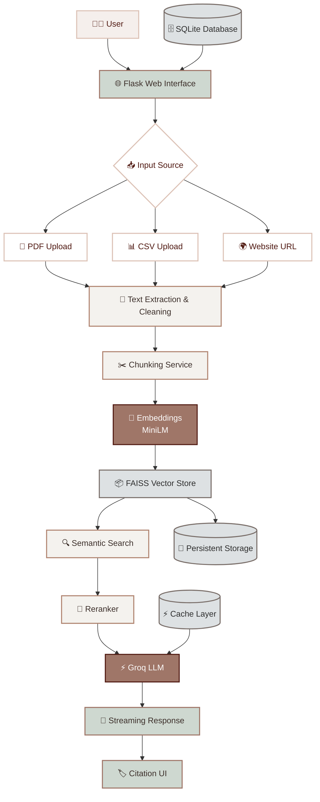

# ResearchMindAI
# 🧠 ResearchMind AI

> Intelligent Research Assistant powered by Retrieval-Augmented Generation (RAG), Semantic Search, FAISS, and Groq LLMs.

ResearchMind AI allows users to upload PDFs, CSV files, and website URLs, then interact with the content through a modern AI-powered chat interface.

---

# ✨ Features

## 📄 Document Processing

* Upload PDF files
* Upload CSV files
* Scrape website content
* Automatic text extraction
* Text cleaning pipeline

## 🧠 AI Retrieval Pipeline

* Smart chunking
* Sentence Transformer embeddings
* FAISS vector database
* Semantic similarity search
* Reranking for better context retrieval

## 🤖 AI Answer Generation

* Groq LLM Integration
* Streaming responses
* Context-aware answers
* Citation support

## ⚡ Performance

* In-memory caching
* Session-based document isolation
* Persistent FAISS storage
* Fast retrieval pipeline

## 🎨 User Interface

* Modern research dashboard
* Active document tracking
* ChatGPT-style conversation interface
* Elegant responsive design

---

# 🏗️ System Architecture



---

# 🛠️ Tech Stack

### Backend

* Python
* Flask
* SQLAlchemy

### AI & Machine Learning

* Sentence Transformers
* FAISS
* Groq API

### Database

* SQLite

### Frontend

* HTML
* CSS
* JavaScript

---

# 📂 Project Structure

```text
ResearchMindAI
│
├── app.py
├── config.py
├── models.py
├── extensions.py
├── requirements.txt
│
├── services
│   ├── cache.py
│   ├── chunking_service.py
│   ├── embedding_service.py
│   ├── faiss_manager.py
│   ├── groq_service.py
│   ├── pdf_service.py
│   ├── rag_service.py
│   ├── reranker.py
│   ├── text_cleaner.py
│   └── web_scraper.py
│
├── templates
│   └── index.html
│
├── static
│   ├── css
│   └── images
│
└── uploads
```

---

# 📸 Screenshots

## 🏠 Home Dashboard

Save screenshot as:

```text
screenshots/home.png
```

Then add:

```md

```

---

## 📄 Upload Document

Save screenshot as:

```text
screenshots/upload.png
```

Then add:

```md

```

---

## 💬 Ask Questions

Save screenshot as:

```text
screenshots/chat.png
```

Then add:

```md

```

---

# ⚙️ Installation

Clone the repository:

```bash
git clone https://github.com/riyagandhi27/ResearchMindAI.git
cd ResearchMindAI
```

Create virtual environment:

```bash
python -m venv venv
```

Activate environment:

### Windows

```bash
venv\Scripts\activate
```

Install dependencies:

```bash
pip install -r requirements.txt
```

Create `.env`

```env
GROQ_API_KEY=your_groq_api_key
```

Run application:

```bash
python app.py
```

Open:

```text
http://127.0.0.1:5000
```

---

# 🚀 Future Improvements

* Multi-document search
* Hybrid Search (BM25 + FAISS)
* PostgreSQL support
* Redis caching
* User authentication
* Research report generation
* Docker deployment

---

# 👩‍💻 Author

**Riya Gandhi**

GitHub: https://github.com/riyagandhi27

---

# ⭐ Project Status

**ResearchMind AI v1.0**

A stable Retrieval-Augmented Generation (RAG) application featuring document ingestion, semantic search, reranking, persistent vector storage, caching, and Groq-powered conversational AI.
